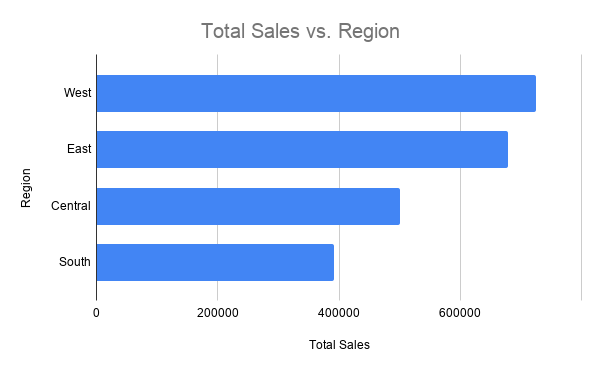
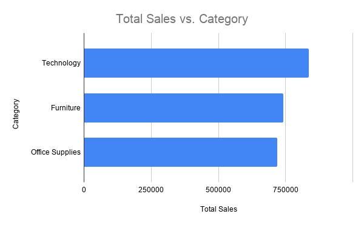
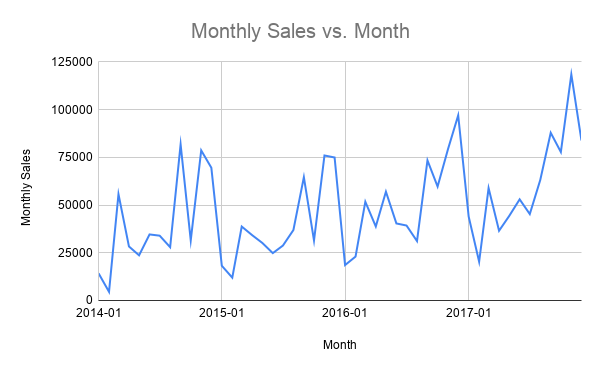

# SQL Sales Data Analysis

## Overview
This project analyzes retail sales data using SQL to identify revenue trends, top-performing products, regional sales performance, and customer segments. The goal was to answer common business questions and turn raw sales data into useful insights.

## Tools Used
- SQL
- SQLite
- DB Browser for SQLite
- Excel / Google Sheets

## Business Questions Answered
- What is the total sales revenue?
- Which region generated the most sales?
- Which category performed best?
- Which products generated the highest sales?
- Which states had the highest sales?
- Which customer segment contributed the most revenue?
- How did sales change month by month?

## Key Insights
- The West region generated the highest total sales.
- Technology was the top-performing product category by revenue.
- Consumer customers contributed the largest share of sales.
- Monthly sales trends showed changes over time, which can help identify stronger and weaker sales periods.

## Files Included
- `data/superstore.csv` - original dataset
- `queries/project_queries.sql` - SQL queries used for analysis
- `charts/sales_by_region.png` - bar chart showing sales by region
- `charts/sales_by_category.png` - bar chart showing sales by category
- `charts/monthly_sales_trend.png` - line chart showing monthly sales trends

## Project Outcome
This project demonstrates skills in SQL querying, business analysis, data exploration, and data visualization. It shows how sales data can be used to support business decision-making.

## Visualizations

### Sales by Region

### Sales by Category

### Monthly Sales Trend

